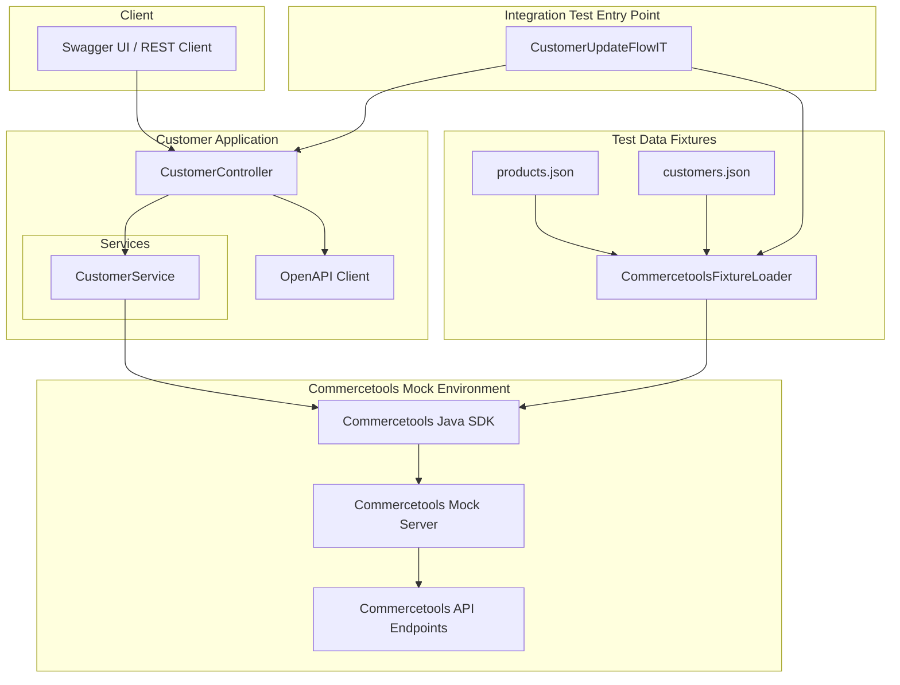

# Demo Commercetools Integration App

## Overview

This project is a **Spring Boot 3.5 application** that demonstrates integration with **Commercetools** using a **mock server** for testing purposes. Its primary functionality is to **update customer information** (first name and last name) via REST API calls, leveraging the Commercetools Java SDK. The application also exposes OpenAPI-compliant endpoints, allowing easy testing and integration.

---

## Features

- Update single or multiple customers in Commercetools.
- Uses **Commercetools SDK v19.4.0** for API integration.
- REST endpoints implemented with Spring Web.
- OpenAPI 3.1 compliant, with Swagger UI support.
- Integration testing support using **JUnit 5** and **Testcontainers** with a Commercetools mock server.
- Ephemeral test environment for safe experimentation with customer data.

---

## Tech Stack

- **Java 21**
- **Spring Boot 3.5**
- **Commercetools Java SDK v19.4.0**
- **Maven** for build and dependency management
- **Testcontainers** for integration testing with mock server
- **OpenAPI 3.1** for API specification
- **Swagger UI** for API exploration
- **Docker** to run the Commercetools mock server

---

## Architecture

The application consists of the following main components:

1. **Controller Layer**
   - `CustomerController` exposes `/api/customers` endpoints.
   - Handles HTTP requests for updating customer information.
   - Validates request consistency (e.g., path key matches request body key).

2. **Service Layer**
   - `CustomerService` interacts directly with the Commercetools SDK.
   - Performs customer update operations using `CustomerUpdateAction`.
   - Handles first name and last name updates.

3. **API Client**
   - Generated OpenAPI client (`at.ct.mock.demo.client`) for API contracts.
   - Supports REST integration with typed models.

4. **Configuration**
   - `application.yaml` contains application properties, Commercetools project credentials, and Swagger UI configuration.

5. **Testing**
   - Integration tests using **JUnit 5** and **Testcontainers**.
   - Spins up a temporary Commercetools mock server for end-to-end testing.
   - Supports multiple test scenarios without touching real data.

### End-to-Ende Test Architecture


---

## API Endpoints
Swagger UI is available for exploring the API at:  
[http://localhost:8080/swagger-ui/index.html](http://localhost:8080/swagger-ui/index.html)
### Update Single Customer

- **PUT** `/api/customers/{key}`
- Updates customer data by unique key.
- Request body example:

```json
{
  "key": "customer-1",
  "firstName": "John",
  "lastName": "Doe"
}
```


