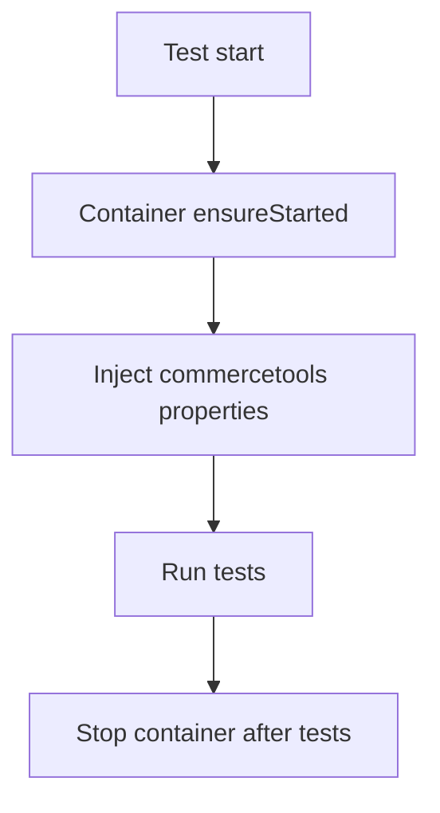

# common-test-utils

📦 **common-test-utils** is a lightweight test utility library that provides a ready-to-use setup for integration tests against the [labdigital/commercetools-mock-server](https://hub.docker.com/r/labdigital/commercetools-mock-server).  
It is designed to be dropped into any Spring Boot project so you can easily run your tests with a mock commercetools backend.

---

## ✨ Features

- 🔌 **Automatic Testcontainers integration** – spins up a `labdigital/commercetools-mock-server` container before your tests run.
- 🔑 **Applies test properties automatically** (`commercetools.auth-url`, `commercetools.api-url`) so your application uses the mock server transparently.
- ♻️ **Manages lifecycle** of the container across the test suite:
    - Starts once before the first test.
    - Stops after all tests are finished.
- 🏷️ Provides the convenient `@CommercetoolsTest` annotation for integration testing.

---

## 🚀 Usage

### 1. Add dependency

Add the library to your **test scope** in your project’s `pom.xml`:

```xml
<dependency>
    <groupId>at.ct.mock</groupId>
    <artifactId>common-test-utils</artifactId>
    <version>0.0.1-SNAPSHOT</version>
    <scope>test</scope>
</dependency>
```

### 2. Annotate your tests
Use the provided @CommercetoolsTest annotation in your integration tests:

```java
package org.example;

import at.ct.mock.commontestutils.CommercetoolsTest;
import org.junit.jupiter.api.Test;
import org.springframework.beans.factory.annotation.Autowired;

import static org.junit.jupiter.api.Assertions.assertEquals;

@CommercetoolsTest
class CustomerUpdateFlowIT {

    private final DefaultApi customerClient;
    private final CommercetoolsFixtureLoader fixtureLoader;
    private final ProjectApiRoot commercetoolsClient;

    public CustomerUpdateFlowIT(@Autowired final DefaultApi customerClient, @Autowired  final CommercetoolsFixtureLoader fixtureLoader, @Autowired  final ProjectApiRoot commercetoolsClient) {
        this.customerClient = customerClient;
        this.fixtureLoader = fixtureLoader;
        this.commercetoolsClient = commercetoolsClient;
    }

    @BeforeAll
    void beforeAll() throws Exception {
        fixtureLoader.load(FixtureScenario.CUSTOMERS);
    }

    @Test
    void runUpdateCustomerHappyPath() {
        var customerUpdate = new CustomerUpdate();
        customerUpdate.setKey("customer-1");
        customerUpdate.setFirstName("daniel");

        // run
        customerClient.updateCustomer("customer-1", customerUpdate);

        // assert
        Awaitility.await()
                .atMost(3, TimeUnit.SECONDS)
                .untilAsserted(
                        () -> {
                            var customer = commercetoolsClient.customers().withKey("customer-1").get().executeBlocking().getBody();
                            assertEquals("daniel", customer.getFirstName());
                        });
    }
}
```
## 🔄 Lifecycle of the Mockserver
The lifecycle is fully managed by the CommercetoolsMockServerInitializer:


### 1. Startup
Before any test runs, the Testcontainers `GenericContainer` for  
`labdigital/commercetools-mock-server:latest` is created.

- Exposes port `8989` in docker container and uses a random-port for the host.
- Mounts your local `src/main/resources/fixtures` into the container under `/data`.
- The container is started **once per test class**.

### 2. Property Injection
Once running, the initializer injects dynamic properties into the Spring `Environment`:

- `commercetools.auth-url` → `http://<host>:<mappedPort>/oauth/token`
- `commercetools.api-url` → `http://<host>:<mappedPort>`

This ensures your application **transparently communicates** with the mock server.

### 3. Testing commercetools mock server API

The mock server **does not persist any data**. Any required test data must be imported **before running an integration test**.

Nevertheless, the Commercetools API is fully available and can be interacted with from your application.

As described before, the `http://<host>:<mappedPort>` URLs are **dynamic** - random port mappings are assigned for each test executions. 
This enables running multiple tests in parallel and reduces any port conflicts over a set of possible environments. 

You can inspect these dynamic values in several ways:

1. **Docker Desktop** – check the running container’s ports.
2. **Docker CLI** – run `docker ps` or `docker port <container_id>`.
3. **Debugging** – inspect the container directly from your application or test.

Example API Endpoint:

`http://localhost:56239/test-project/products`

You can use any project-key (i.e. `"test-project"`) and no authentication is required. 

Expected response:
```json
{
"count": 0,
"total": 0,
"offset": 0,
"limit": 20,
"results": []
}
```

### 4. Teardown
After all tests in the class are executed, the container is **stopped**.

- Because `@DirtiesContext` is used, the Spring test context is **refreshed after each class**, ensuring isolation.


### 💡 Why use this library?

🔁 No repetitive boilerplate in each project.

🛠 Unified way to test against commercetools without hitting real APIs.

🏷 Drop-in annotation simplifies test setup for teams.
After all tests in the class are executed, the container is stopped.

