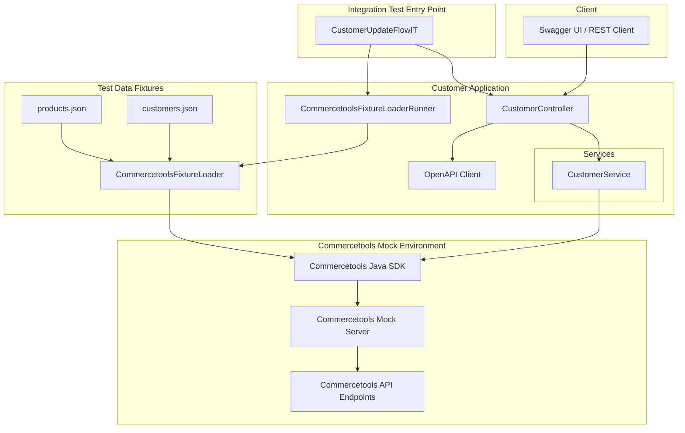

# Demo Commercetools Integration App

## Overview

This project is a **Spring Boot 3.5 application** that demonstrates integration with **Commercetools** using a **mock server** for testing purposes. Its primary functionality is to **crud customer information** via REST API calls, leveraging the Commercetools Java SDK. The application also exposes OpenAPI-compliant endpoints, allowing easy testing and integration.

With the **demo profile**, the application can run with a **runtime mock server** and automatically load predefined fixtures for products, customers etc. making it possible to test the full workflow without connecting to a real Commercetools environment.

---

## Features

- Update single or multiple customers in Commercetools.
- Uses **Commercetools SDK v19.4.0** for API integration.
- REST endpoints implemented with Spring Web.
- OpenAPI 3.1 compliant, with Swagger UI support.
- Demo profile with **runtime mock server** for application-level testing.
- Automatic loading of **product and customer fixtures** in demo mode.
- Integration testing support using **JUnit 5** and **Testcontainers**.
- Ephemeral test environment for safe experimentation with customer data.

---

## Tech Stack

- **Java 21**
- **Spring Boot 3.5**
- **Commercetools Java SDK v19.4.0**
- **Maven** for build and dependency management
- **Testcontainers** for integration testing and mock server
- **OpenAPI 3.1** for API specification
- **Swagger UI** for API exploration
- **Docker** to run the Commercetools mock server

---

## Architecture

The application consists of the following main components:

1. **Controller Layer**
   - `CustomerController` exposes `/api/customers` endpoints.
   - Handles HTTP requests for updating customer information.
   - Validates request consistency (e.g., path key matches request body key).

2. **Service Layer**
   - `CustomerService` interacts directly with the Commercetools SDK.
   - Performs customer update operations using `CustomerUpdateAction`.
   - Handles first name and last name updates.

3. **API Client**
   - Generated OpenAPI client (`at.ct.mock.demo.client`) for API contracts.
   - Supports REST integration with typed models.

4. **Runtime Initializer**
   - `CommercetoolsMockServerRuntimeInitializer` starts a **mock Commercetools server** using Testcontainers.
   - Dynamically configures environment properties (`commercetools.api-url` and `commercetools.auth-url`) to point to the mock server.
   - Adds a JVM shutdown hook to stop the container when the application exits.

5. **Fixture Loader**
   - `CommercetoolsFixtureLoaderRunner` automatically loads **products** and **customers fixtures** when the demo profile is active.
   - Ensures fixtures are loaded **after the mock server is ready**, allowing the application to interact with them immediately.

6. **Testing**
   - Integration tests using **JUnit 5** and **Testcontainers**.
   - Supports end-to-end testing with temporary mock server and fixtures.
   - Tests run safely without touching real Commercetools data.

### End-to-End Test Architecture


## API Endpoints

Swagger UI is available for exploring the API at:  
[http://localhost:8080/swagger-ui/index.html](http://localhost:8080/swagger-ui/index.html)

### Update Single Customer

- **PUT** `/api/customers/{key}`
- Updates customer data by unique key.
- **Request body example**:

```json
{
  "key": "customer-1",
  "firstName": "John",
  "lastName": "Doe"
}
```
### Get Customer by Key

- **GET** `/api/customers/{key}`
- Retrieves customer data by unique key.

- **Response example**:

```json
{
  "key": "customer-1",
  "firstName": "John",
  "lastName": "Doe",
  "email": "john.doe@example.com"
}
```