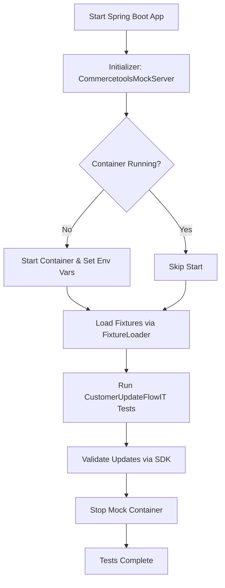

# Commercetools Integration Test Setup

## Overview

This project contains **integration tests** for a Spring Boot application that interacts with **Commercetools**. The tests validate that customer data can be **updated via REST API** and correctly **persisted in the Commercetools backend**.

The tests use a **Commercetools mock server** (Docker container) to provide a safe, ephemeral environment, allowing testing without touching production data.

---

## Key Components

### 1. **CustomerUpdateFlowIT**

- **Location:** `at.ct.mock.demo.CustomerUpdateFlowIT`
- Main integration test class for customer update flows.
- **Annotations:**
    - `@CommercetoolsTest` → custom annotation that wraps Spring Boot test configuration and handles mock server lifecycle.
- **Purpose:**
    1. Load predefined fixtures (customers and products) into the mock Commercetools server.
    2. Call REST API endpoints to update customers.
    3. Validate updates using the Commercetools Java SDK.
- **Highlights:**
    - Uses **Awaitility** to wait for asynchronous updates.
    - Ensures deterministic, repeatable integration tests.

---

### 2. **CommercetoolsMockServerInitializer**

- **Location:** `at.ct.mock.demo.server.CommercetoolsMockServerInitializer`
- Manages the lifecycle of the **mock Commercetools server** using Testcontainers.
- **Responsibilities:**
    - Start the container and expose port `8989`.
    - Mount local fixtures (`src/test/resources/fixtures`) into the container.
    - Dynamically configure Spring Boot environment properties:
        - `commercetools.auth-url`
        - `commercetools.api-url`
    - Implements JUnit 5 lifecycle hooks:
        - `BeforeAllCallback` → starts container before tests.
        - `AfterAllCallback` → stops container after tests.
- Ensures that the mock server runs only once per test run for efficiency.

---

### 3. **@CommercetoolsTest Annotation**

- **Location:** `at.ct.mock.demo.server.CommercetoolsTest`
- Combines Spring Boot test setup with the mock server lifecycle:
    - Starts Spring Boot application on a random port.
    - Initializes environment properties for Commercetools SDK.
    - Registers JUnit 5 extension hooks for container lifecycle.
- Simplifies test classes by requiring **only** `@CommercetoolsTest`.

---

### 4. **CommercetoolsFixtureLoader**

- Loads **predefined fixtures** (JSON files) into the mock Commercetools server.
- Supports:
    - Customers (`customers.json`)
    - Products (`products.json`)
- Ensures a **known, predictable state** for integration tests.
- Uses Commercetools Java SDK (`ProjectApiRoot`) and Jackson `ObjectMapper`.

---

## Test Flow

1. **Setup**
    - Spring Boot starts on a random port.
    - `CommercetoolsMockServerInitializer` starts the Docker container.
    - Fixtures are loaded via `CommercetoolsFixtureLoader`.

2. **Execution**
    - Integration tests perform REST API calls using `DefaultApi`.
    - Changes are applied in the mock Commercetools server.
    - The Java SDK validates the results.

3. **Validation**
    - Assertions check updated customer fields.
    - **Awaitility** ensures asynchronous operations complete.

4. **Teardown**
    - Container is stopped after all tests.
    - Ensures isolation and avoids interference between test runs.

---

## Test Fixtures

- Located in `src/test/resources/fixtures`.
- **customers.json** → predefined customers (e.g., `customer-1`).
- **products.json** → predefined products.
- Loaded automatically before tests by `CommercetoolsFixtureLoader`.

---

## Running the Tests

```bash
# Run all integration tests
mvn clean test
```

## Lifecycle Diagram


